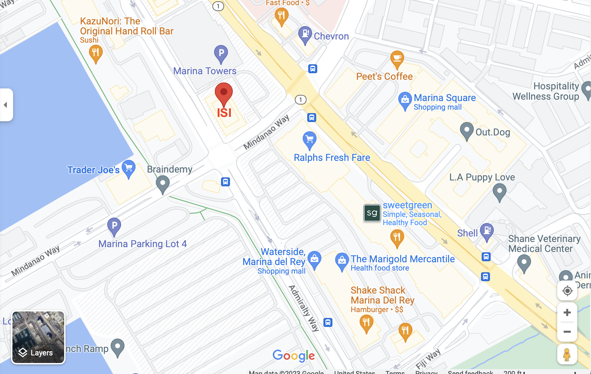

Here is what you need to know about the [Information Sciences Institute](https://www.isi.edu/) and Marina Del Rey

## <a name='gettingto'> Getting to Marina Del Rey </a>

ISI is located in Marina Del Rey, CA:

4676 Admiralty Way, Suite 1001
Marina del Rey, CA 90292

[Directions](https://goo.gl/maps/2f9C6U5hdMS3SQut9)

Cab fare is approximately $20-$25 from LAX and $40 from the USC main campus.

Visitor Parking:

You may park in either the parking lot or in the attached parking structure. Please remember to bring your parking ticket with you to be validated by ISI’s receptionist on the 10th floor.

## <a name='gettingaround'> Getting to Marina Del Rey </a>

Public transportation in Marina Del Rey is through Metro, the Culver City Green Bus Line, and the Santa Monica Big Blue Bus. There also more local options such as a waterbus that can get you from one side of the Marina to the other in a fun way. For more information, see [this website](https://visitmdr.com/plan-your-visit/transportation). If you decide to stay in another location than MDR for the meeting, remember the Los Angeles saying: "It will take 45 minutes!" This is true, even for a 4-mi drive. 

## <a name='meals'> Meals </a>

We will not be providing meals during the workshop (on the bright side, your registration is free). There are many options to eat near ISI, including two shopping malls with several lunch options within a 5min walk from the building. The area across Mindanao has a Ralphs along with other dining options such Chipotle, Mendocino Farms (sandwich and salads), California Pizza Kitchen, a burger place. The other mall on the other side of Lincoln (Marina Square Shopping Mall) also contains dining options. There is a Trader Joe’s across the street from the building.

## <a name='familycare'> Family Care around ISI </a>

Here are available options around ISI. 