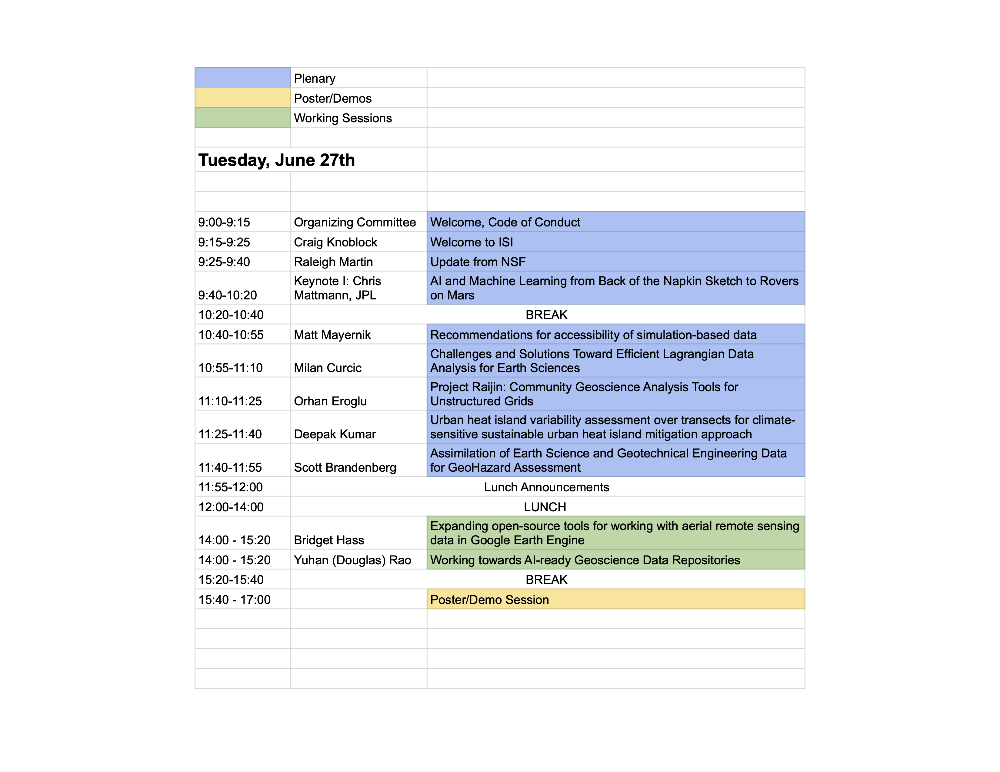
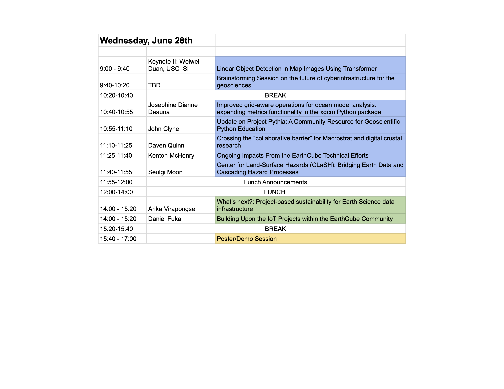

* [Call for abstract](#abstract)  

* [Keynote Speakers](#keynote)

* [Schedule](#schedule)

Registration opening soon!

## <a name='abstract'> Call for abstract </a>

We welcome abstracts for:  

* Posters and Oral Presentations

* Demonstrations (including electronic notebooks)  

* Working sessions  

**Timeline:**

**Extended to May 8th**: Abstract due. Abstract submission [form](https://forms.gle/q99VhH7fUChYvdRh8).  
May 10: Notification of acceptance of abstract and travel award  
June 27-28: Building upon the EarthCube Community Workshop

### Posters and Oral Presentations

As with many scientific meetings and conferences, these presentations will be the key communication platform.  The date/time of your presentation will be communicated to presenters upon acceptance. *Please note: there will be a limited number of oral presentations.*

We are solicitating contributions focused on the following subjects:  

* Science/tools enabled by geoinformatics projects  

* Broader outcomes that have used tools developed through a geoinformatics project (notebooks, workshops, courses)  

* Social and DEI impacts of geoinformatics projects, from accessibility to equity  

* Results from Research Coordination Networks

### Demonstrations

We welcome demonstrations (including Jupyter Notebooks) that would be of broad interest to the community. Participants will be expected demo their tools at the workshop. For the demo, a link to a website or a fully executable notebook in [myBinder](https://mybinder.org) is requested. 

### Working Sessions

We welcome submissions for working sessions. Working sessions may consist of mini hack-a-thons, do-a-thons, work-a-thons, or other kinds of sessions in which the community is engaged to discuss particular questions, provide feedback on new technologies, or evaluate new frameworks for data policies, procedures, or workflows. The goal of working sessions are to move the community forward on particular topics of interest to the community.

To propose a working session please indicate:  

* Session Title  

* Session Leaders  

* Session Overview  

* Key Session Activities  

* Key Session Outcome/Product  

* How will the outcomes be shared?  

* Required materials or technology  

* How will the organizers involve early-career participants in their session?  

* How will the organizers involve members of an underrepresented groups in the geo/computer sciences in their session?  

### Submission

Submit your abstract [here](https://forms.gle/q99VhH7fUChYvdRh8) by May 8th, 2023!

## <a name='keynote'> Keynote Speakers </a>

### Dr. Chris Mattmann, NASA JPL

*Title*: AI and Machine Learning from Back of the Napkin Sketch to Rovers on Mars

*Bio*: Chief Technology and Innovation Officer at the NASA Jet Propulsion Laboratory, his work has helped NASA explore space, and helped journalists and governments track international financial crime amongst the world’s elite across the globe.
 
He is best known for a 20-year career inventing the most downloaded software on the planet creating technology that powers all the data systems in the industry. Tika, the “digital babel fish” is the key technology that solved the Panama Papers and won the Pulitzer Prize in journalism in 2017. 

### Weiwei Duan, USC Information Sciences Institute

*Title*: Linear Object Detection in Map Images Using Transformer

## <a name='schedule'> Schedule </a>

This tentative schedule is subject to change. 

